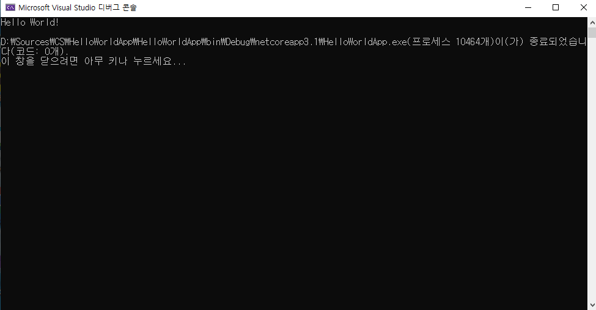

# HTML 학습 리포지토리
HTML5, CSS3, JS 학습용 리포지토리

------------

## HTML5
HTML 기본 학습

> 마크다운은 일반 텍스트 기반의 경량 마크업 언어다. 일반 텍스트로 서식이 있는 문서를 작성하는 데 사용되며, 일반 마크업 언어에 비해 문법이 쉽고 간단한 것이 특징이다.

### HTML이란?
개요에 대해서 학습합니다.

1. Hyper Text Markup Language 정의
2. HTML 역사
3. HTML5의 차이점

- Hyper Text Markup *Language* 정의
- **HTML** *역사*
- **HTML5의 ~차이점~**
  - UL1
  - ~UL2~
      - UL3
     
```C#
using System.IO;

namespace HelloWorld App {
  public class Program {
    public static void Main(String[] args) {
      Console.Writeline("Hello,World!");
     }
   }
 }
 
 ```
 
####실행결과 




 
 참조링크
 ---------------
 
 - [Microsoft](https://www.microsft.com)
 - [Naver](https://www.naver.com)
    


---------------

## CSS
CSS 기본 학습

> CSS is Cascading Style Sheet

`홑따옴표 아니고 물결 밑에 있는 키 (테스트 코드)`

----------------

## Javascript
Javascript 기본 학습

----------------

## Responsive Web
응답형 웹 기본 학습

-----------------

## Project
전체 통합 프로젝트


----------------

문의메일 : whgmlwl222@naver.com
